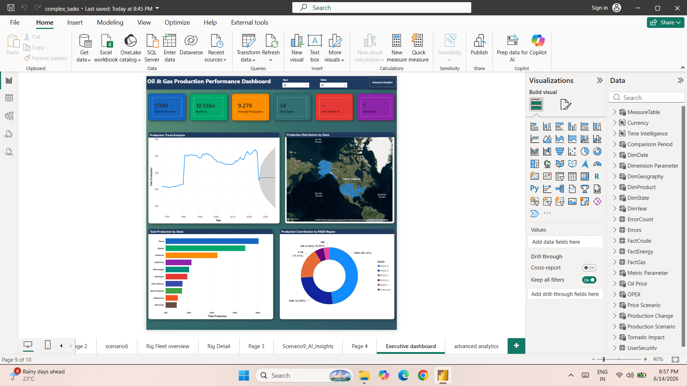

# ⛽ Oil & Gas Production Analytics Dashboard

## 📌 Project Overview

This Power BI project provides a comprehensive analysis of Oil & Gas production performance across US states and PADD (Petroleum Administration for Defense Districts) regions.

The solution combines executive reporting, advanced analytics, forecasting, geographic analysis, and security controls to support data-driven decision making for business stakeholders.

---

## 🎯 Business Objectives

- Monitor production performance across states and regions.
- Analyze revenue contribution and production trends.
- Identify key production drivers and influencers.
- Track year-over-year growth and forecast future production.
- Enable secure access through Row Level Security (RLS).
- Provide interactive navigation and drillthrough capabilities.

---

## 📊 Dashboard Pages

### 1️⃣ Executive Dashboard

Executive-level overview of production and revenue performance.

#### KPIs
- Total Production
- Revenue
- Average Production
- Total States
- YoY Growth %
- State Rank

#### Visuals
- Production Trend Analysis
- Production Distribution by State (Map)
- Top Producing States
- Production Contribution by PADD Region
- Dynamic Slicers (Year, State)

---

### 2️⃣ Advanced Analytics & Operational Insights

Detailed analytical view for business users.

#### KPIs
- Top Revenue State
- State Rank
- Total Products
- Top PADD Region

#### Visuals
- Decomposition Tree
- Key Influencers
- Revenue vs Production Analysis
- Geographic Performance Matrix
- Production Performance vs Target Gauge
- Revenue Contribution Pie Chart

#### Advanced Features
- Bookmark Navigation
- Dynamic Menu Panel
- Drillthrough Analysis
- Interactive Filtering

---

## 🚀 Features Implemented

### Data Modeling
- Star Schema Design
- Dimension & Fact Tables
- Relationship Management

### DAX Measures
- Total Production
- Revenue
- Average Production
- State Rank
- YoY Growth %
- Previous Year Production
- Forecast Measures
- Production Target Measures

### Time Intelligence
- Previous Year Analysis
- Year-over-Year Growth
- Trend Analysis

### Advanced Analytics
- Decomposition Tree
- Key Influencers
- Forecasting
- Anomaly Detection

### Interactivity
- Drill Down
- Drill Through
- Bookmarks
- Buttons
- Dynamic Navigation Menu
- Cross Filtering

### Security
- Dynamic Row Level Security (RLS)
- User-based State Access Control

---

## 🔒 Row Level Security (RLS)

Implemented Dynamic RLS using a UserSecurity table.

Example:

| Email | State |
|---------|---------|
| manager1@esi.com | Texas |
| manager1@esi.com | Alaska |
| manager2@esi.com | California |
| manager2@esi.com | Alabama |

Users only view data assigned to their authorized states.

---

## 🛠 Tools & Technologies

- Power BI Desktop
- DAX
- Power Query
- Data Modeling
- Row Level Security (RLS)

---

## 📈 Key Insights Generated

- Texas is the highest revenue-generating state.
- PADD 3 contributes the largest share of production.
- Revenue and production show strong positive correlation.
- Production trends indicate long-term growth patterns.
- Top-performing states contribute the majority of total production.

---

## 📷 Dashboard Screenshots

### Executive Dashboard



### Advanced Analytics


### Bookmark Navigation


### RLS Testing


---

## 📂 Repository Structure

```text
Oil-Gas-Production-Analytics-Dashboard
│
├── README.md
├── Oil_Gas_Production_Analytics.pbix
│
├── screenshots
│   ├── executive-dashboard.png
│   ├── advanced-analytics.png
│   ├── bookmarks.png
│   └── rls.png
│
└── documentation
    └── Project_Documentation.pdf
```

---

## 👨‍💻 Author

**Ajit Singh**

Power BI Developer | Data Analyst

---

## ⭐ Skills Demonstrated

- Power BI Development
- Data Modeling
- DAX
- Time Intelligence
- Forecasting
- Advanced Analytics
- Drillthrough & Bookmarks
- Dynamic Navigation
- Row Level Security (RLS)
- Dashboard Design
- Business Intelligence
